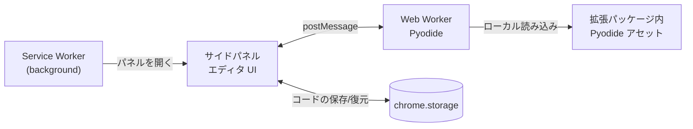

# 基本設計

本ドキュメントは、[ADR](ADR/) で決定した内容をひとつの構成としてまとめたものである。個々の選定理由は各 ADR を参照すること。設計上の新たな決定が生じた場合は、本ドキュメントを直接書き換えるのではなく ADR を起こし、その結果を本ドキュメントに反映する。

## 1. 目的とスコープ

参考となる Web ページを開いたまま、タブ構成を変えずに Python コードを書いて実行できる Chrome 拡張機能。ブラウザだけで完結し、ローカルの Python 環境を必要としない。

**対象** — Python 標準ライブラリの範囲でのコード編集と実行
**対象外** — サードパーティパッケージの利用、複数ファイルからなるプロジェクトの開発、既存 IDE の置き換え

## 2. 全体構成



構成要素は 3 つで、それぞれ独立した実行コンテキストに置かれる。

| コンポーネント | 実行コンテキスト | 責務 |
| --- | --- | --- |
| Service Worker | 拡張のバックグラウンド | ツールバーアイコンでサイドパネルを開く設定のみ |
| サイドパネル UI | サイドパネルの文書 | エディタの表示、実行/停止操作、出力表示、コードの永続化 |
| Pyodide Worker | Web Worker | Pyodide の初期化とユーザコードの実行 |

### 2.1 Service Worker

責務は意図的に最小に留める。インストール時に `chrome.sidePanel.setPanelBehavior({ openPanelOnActionClick: true })` を設定するだけで、実行にもエディタ状態にも関与しない。

Service Worker は待機状態が続くと停止されるため、状態を持たせない（[ADR 0004](ADR/0004-use-pyodide-as-python-runtime.md)）。

### 2.2 サイドパネル UI

エディタ本体。CodeMirror 6 でコードを編集し、Worker へ実行を依頼して結果を表示する。**Python コードをこのスレッドで実行することはない。**

#### エディタの構成

CodeMirror 6 は `basicSetup` を使わず、拡張を明示的に並べて構成する（[ADR 0014](ADR/0014-compose-codemirror-extensions-explicitly.md)）。

**含める** — 行番号（`lineNumbers`）、Python の構文解析とハイライト（`python()` + 自前の `HighlightStyle`）、undo / redo（`history`）、基本キーマップ（`defaultKeymap`）、入力時のデデント（`indentOnInput`）、Tab インデント（`indentWithTab` + スペース 4）、括弧の補完と対応表示（`closeBrackets` / `bracketMatching`）、補完（`autocompletion`。補完ソースは `python()` が登録する `localCompletionSource` と `globalCompletion` に任せる。[ADR 0018](ADR/0018-delegate-completion-sources-to-python-support.md)）、選択とカーソルの描画（`drawSelection` / `dropCursor` / `highlightSpecialChars`）、構文チェックの表示（`lint`、§3.4）

**含めない** — 折りたたみ（ガターをもう 1 列使う）、検索（狭い幅にパネルを重ねる）、現在行の強調と一致強調（配色トークンが未定義）、矩形選択

**行の折り返しは行わない。** 折り返すと行番号と表示行がずれるため、長い行は横スクロールで扱う。ハイライトの色は Figma の `syntax/*` トークンと 1 対 1 で対応させる（[ADR 0009](ADR/0009-use-light-theme-as-base.md)）。

#### コードの永続化

パネルを閉じると文書は破棄されるため、編集中のコードは `chrome.storage.local` へ**単一のレコードとして自動保存**する（[ADR 0013](ADR/0013-persist-code-in-storage-local.md)）。

| | |
| --- | --- |
| 置き場所 | `chrome.storage.local`。レコードは 1 件で、バージョン欄を持つ |
| 契機 | 入力停止から 500ms のデバウンスを主とし、実行時と `visibilitychange` で hidden になったときのフラッシュを従として併せる（[ADR 0019](ADR/0019-flush-on-visibilitychange-hidden.md)）。`pagehide` は使わない |
| 保存するもの | コード、キャレット位置、スクロール位置 |
| 保存しないもの | **出力領域の内容。** 開き直した時点で Worker は作り直されており、前回の結果だけが残ると現在の出力と誤読されるため |
| 競合 | 複数ウィンドウで同時に開かれた場合は**後勝ち**。`storage.onChanged` による追従は行わない |

復元は Pyodide の初期化を待たずに行う（§3.1 でエディタは初期化前から編集可能なため）。復元直後の出力領域は常に空になる。

**タブを切り替えてもサイドパネルの文書は破棄されない。** 一方、**パネルを閉じると破棄される**（[ADR 0019](ADR/0019-flush-on-visibilitychange-hidden.md)）。両者は `visibilitychange` の hidden では区別できないため、hidden になるたびにフラッシュする。

### 2.3 Pyodide Worker

Pyodide の初期化とユーザコードの実行のみを行う。DOM には触れず、出力はすべて `postMessage` で UI へ送る（[ADR 0005](ADR/0005-run-pyodide-in-web-worker.md)）。標準入力も同じ経路で UI に問い合わせる（[ADR 0012](ADR/0012-implement-stdin-as-terminal-with-jspi.md)）。

同梱する Pyodide は JSPI に対応したバージョン（実機で確認した **314.0.7** 以降）とし、ユーザコードは `pyodide.runPythonAsync` 経由で実行する。標準入力は `pyodide.setStdin()` ではなく **`builtins.input` の置き換え**で差し替え、応答は `pyodide.ffi.run_sync` で同期的に待つ（[ADR 0016](ADR/0016-replace-builtins-input-instead-of-setstdin.md)）。

Pyodide の実体（`pyodide.asm.wasm`、`python_stdlib.zip` 等）は拡張パッケージ内に同梱されたものをローカルパスから読み込む。CDN からの取得および `micropip` による PyPI からの取得は Manifest V3 が禁止するため行わない（[ADR 0004](ADR/0004-use-pyodide-as-python-runtime.md)）。

## 3. 実行フロー

### 3.1 起動と初期化

1. ユーザがツールバーアイコンをクリックし、サイドパネルが開く
2. UI が Worker を生成する
3. Worker が Pyodide の初期化を開始する
4. **初期化の完了を待たずに、エディタは編集可能な状態で表示する。** 実行ボタンのみ無効にしておく
5. Worker が `runPythonAsync` を一度空打ちして暖機する（[ADR 0025](ADR/0025-warm-up-python-before-ready.md)）
6. 暖機まで終えた時点で Worker が `ready` を送り、UI が実行ボタンを有効化する

Pyodide の初期化は数秒単位のコストがかかるため、エディタ表示と初期化を分離する（[ADR 0004](ADR/0004-use-pyodide-as-python-runtime.md)）。

手順 5 は、最初の実行にかかる追加のコストを `ready` の前に隠すためのものである。暖機しなければ同じ待ちが**実行ボタンを押した後の無反応**として現れる。暖機に失敗しても `initError` とはせず、そのまま `ready` を送る。

### 3.2 実行

1. UI が実行ボタンを無効化し、停止ボタンを有効化し、**出力領域へ実行の区切りを 1 行追記する**（[ADR 0024](ADR/0024-mark-run-boundary-in-output.md)）
2. UI が `run` メッセージでコードを Worker へ送る
3. Worker が実行し、標準出力・標準エラーを**逐次** `stdout` / `stderr` で UI へ送る
4. UI は受信するたびに出力領域へ追記する
5. 実行終了時、Worker が `done`（正常終了）または `error`（例外）を送る
6. UI がボタンの状態を戻す

出力をまとめて送らないのは、長時間実行中に画面が無反応に見える状態を避けるためである（[ADR 0005](ADR/0005-run-pyodide-in-web-worker.md)）。

出力領域は実行の開始時にも**消さない。** 前回の traceback を見ながら直して実行する流れで、直す根拠が消えるためである。繰り返し実行したときの境目は手順 1 の区切りが示す。

**実行中・入力待ちの間もエディタは編集可能である**（[ADR 0026](ADR/0026-keep-editor-editable-while-running.md)）。実行されるのは `run` を送った時点のコードであり、以降の編集は次の実行から反映される。読み取り専用にすると、長い実行の間は「書くために実行を捨てる」しかなくなる。

#### 入力待ち

ユーザコードが `input()` を呼ぶと、実行は**入力待ち**で中断する（[ADR 0012](ADR/0012-implement-stdin-as-terminal-with-jspi.md)）。

1. Worker が `stdin` を UI へ送り、応答が返るまで実行を中断する。`input(prompt)` のプロンプト文字列はこのメッセージに載せる（[ADR 0016](ADR/0016-replace-builtins-input-instead-of-setstdin.md)）
2. UI がステータスを入力待ちに変え、プロンプトを出力領域へ書き出し、その末尾にキャレットを立ててフォーカスを移す
3. ユーザが 1 行入力して確定する
4. UI が入力をそのまま出力領域へ残し、`stdinResult` で Worker へ返す
5. Worker が実行を再開し、以降は §3.2 の 3 以降に戻る

**入力を打ち切る手段として EOF を持つ。** 入力行が空のまま `Ctrl+D` を押すと、UI は `stdinResult` の `text` を `null` として返し、Worker 側の `input()` が `EOFError` を送出する（[ADR 0021](ADR/0021-represent-eof-as-null-stdin-result.md)）。EOF がないと、行を読み尽くすまで回るコードから抜ける手段が停止ボタンだけになる。

**複数行を貼り付けた場合、改行は入力の確定として解釈する**（[ADR 0022](ADR/0022-queue-pasted-lines-as-stdin.md)）。先頭の行がいま待っている `input()` へ渡り、残りはキューに積まれて次の `stdin` で消費される。キューが残っている間、手順 2 と 3 は省かれる。キューは実行の終了と停止で捨てる。

Worker は JSPI のスタックスイッチングによって待つ。**スレッドを止めるわけではない**ため、待機中も Worker のメッセージ受信は生きており、応答は通常の `postMessage` で渡せる。この経路を成立させるため、ユーザコードの実行は `pyodide.runPythonAsync` を通す。

入力待ちの間も停止ボタンは有効で、`terminate()` は通常どおり効く（§3.3）。

### 3.3 停止

Pyodide はシングルスレッドで動作するため、実行中のユーザコードへ「中断」を伝える手段がない。停止は **Worker の破棄**で実現する。

1. ユーザが停止ボタンを押す
2. UI が `worker.terminate()` を呼ぶ
3. **Worker と共に Pyodide の状態がすべて失われる**
4. UI は直ちに新しい Worker を生成し、初期化を先行させておく
5. 初期化完了後、実行ボタンを再び有効化する

停止直後に次の実行を待たせないよう、Worker の作り直しは停止処理の一部として行う。

### 3.4 構文チェック

実行とは独立に、**実行する前**に構文エラーを検出する（[ADR 0015](ADR/0015-check-syntax-before-run-in-worker.md)）。

1. 入力が止まってから 500ms 後、UI が `check` でコードを Worker へ送る（コードの保存と同じ契機、§2.2）
2. Worker が `compile(code, "<editor>", "exec")` を呼ぶ。**ユーザコードは実行しない**
3. Worker が `checkResult` で診断を返す。位置は**行番号と桁のまま**載せる（[ADR 0020](ADR/0020-send-diagnostics-as-line-column.md)）
4. UI が位置を文書先頭からのオフセットへ変換し、エディタ内に下線とツールチップで表示する

手順 3 で CodeMirror の `Diagnostic` を組み立てないのは、**Worker が UI 側の描画ライブラリの型に合わせる**依存の向きを避けるためである。変換に使うべき現在の文書を持っているのも UI 側だけであり、範囲の丸めと変換は同じ側に置く。

CPython は最初の構文エラーで解析を止めるため、**一度に得られる診断は最大 1 件**である。

検査を行わないのは次の場合。Pyodide の**初期化完了前**、および**実行中・入力待ちの間**（§3.2）。その間、既に表示されている下線は消さずに残す。消すと直ったと読めてしまうため。

構文エラーがあっても**実行ボタンは無効にしない**。検査結果は遅れて届くため、連動させるとボタンの活性が入力の合間に揺れる（[ADR 0010](ADR/0010-show-run-state-in-toolbar-status.md)）。

## 4. UI ↔ Worker メッセージ仕様

停止は `terminate()` で行うため、停止要求のメッセージは存在しない。

### UI → Worker

| type | ペイロード | 意味 |
| --- | --- | --- |
| `run` | `{ runId, code }` | コードの実行要求 |
| `stdinResult` | `{ runId, text }` | `stdin` への応答。`text` は確定した 1 行（改行を含まない）。**EOF の場合は `null`**（[ADR 0021](ADR/0021-represent-eof-as-null-stdin-result.md)） |
| `check` | `{ checkId, code }` | 構文チェックの要求（実行は伴わない） |

### Worker → UI

| type | ペイロード | 意味 |
| --- | --- | --- |
| `ready` | なし | Pyodide の初期化完了 |
| `stdout` | `{ runId, text }` | 標準出力（逐次） |
| `stderr` | `{ runId, text }` | 標準エラー（逐次） |
| `stdin` | `{ runId, prompt }` | 標準入力の要求。`prompt` は `input(prompt)` に渡された文字列（既定は空文字）。`stdinResult` が返るまで実行を中断する |
| `done` | `{ runId }` | 正常終了 |
| `error` | `{ runId, message, traceback }` | 実行時例外 |
| `initError` | `{ message }` | Pyodide の初期化失敗 |
| `checkResult` | `{ checkId, diagnostics }` | 構文チェックの結果。`diagnostics` は最大 1 件 |

`runId` は実行ごとの識別子。Worker を破棄せず連続実行した場合に、遅れて届いた出力を破棄済みの実行のものと判別するために用いる。`runId` / `checkId` を採番するのは UI 側だけである。

`diagnostics` の要素は次の形とする（[ADR 0020](ADR/0020-send-diagnostics-as-line-column.md)）。いずれも `SyntaxError` の属性をそのまま写したもので、**CodeMirror の語彙を含まない。**

| 欄 | 内容 |
| --- | --- |
| `line` | `lineno`。1 始まり |
| `column` | `offset`。1 始まり |
| `endLine` | `end_lineno`。無い場合は `null` |
| `endColumn` | `end_offset`。無い場合は `null` |
| `message` | `msg` |

## 5. 画面レイアウト

サイドパネルは表示幅が狭いため、**要素は縦に積む**（[ADR 0006](ADR/0006-use-side-panel-as-editor-surface.md)）。

```
┌─────────────────────────────┐
│ ● 準備完了      [実行] [停止] │  ツールバー 44px
├─────────────────────────────┤
│ 1  import math              │
│ 2                           │
│ 3  def area(r):             │  エディタ (CodeMirror 6)
│ 4      return math.pi*r**2  │  残りの高さをすべて使う
│                             │
├─────────────────────────────┤
│ 出力                 クリア  │
│ 1 半径は? 3                 │  出力領域 220px
│ 2 28.274333882308138        │  stdout / stderr / エラー / 入力
│ 3 半径は? ▌                 │  入力待ちのキャレット
└─────────────────────────────┘
```

VS Code のようなサイドバーとエディタの横並び構成は幅の制約から成立しない。ファイルツリーのような常時表示の横並び UI は設計に含めない。

### 5.1 ツールバー

左端に**実行状態のインジケータとラベル**、右端に実行 / 停止ボタンを置く（[ADR 0010](ADR/0010-show-run-state-in-toolbar-status.md)）。状態はステータス表示が説明し、ボタンの活性がその時点で可能な操作を示す。入力待ち（§3.2）もこのステータスで示す状態のひとつで、実行中と同じくボタンの活性は停止のみとなる。

### 5.2 出力領域

stdout / stderr / エラーを**届いた順に追記**する。種別ごとのタブや領域は設けない。実行時例外（`error`）と初期化失敗（`initError`）はダイアログやトーストを使わず、この領域にインラインで表示する（[ADR 0011](ADR/0011-show-errors-inline-in-output-pane.md)）。

ここに出るのは**実行して得られた結果**に限る。実行前に分かる構文エラーはエディタ内に表示し（§3.4）、この領域には出さない。

この領域は**入力面も兼ねる**（[ADR 0012](ADR/0012-implement-stdin-as-terminal-with-jspi.md)）。`stdin` を受け取ると末尾にキャレットが立ってフォーカスを受け取り、確定した入力はそのまま同じ流れに残る。入力用の欄を別に設けないのは、プロンプト・入力・その結果の前後関係を 1 本の履歴として読めるようにするためで、追記の原則はここでも変わらない。

実行の区切り、停止した旨、復元できなかった旨といった UI 側の説明もこの流れに混ぜる（[ADR 0024](ADR/0024-mark-run-boundary-in-output.md)）。**この領域が消えるのはクリアボタンを押したときだけ**とし、自動で消える経路を作らない。

### 出力の上限

追記には上限を設ける（[ADR 0023](ADR/0023-cap-output-pane-size.md)）。**2,000 行**を超えたら古い方から取り除き、省略した旨を先頭に 1 行残す。改行を含まない巨大な出力に備え、**1 行あたり 10,000 文字**でも切り詰める。入力待ちの行は切り詰めの対象から外す。

上限がないと、`while True: print(...)` のようなコードでパネルの操作が成り立たなくなる。**出力は UI スレッドの DOM に積まれるため、Worker の分離（[ADR 0005](ADR/0005-run-pyodide-in-web-worker.md)）ではこれを防げない。** 停止ボタンを押せなくなることは、Worker を分離した目的そのものが失われることを意味する。

### 5.3 画面設計ファイル

具体的な寸法・配色・状態ごとの見た目は Figma で管理する（[ADR 0008](ADR/0008-manage-screen-design-in-figma.md)）。配色はライトテーマのみを定義する（[ADR 0009](ADR/0009-use-light-theme-as-base.md)）。

**[Figma: web-python-editor 画面設計](https://www.figma.com/design/g4H9KOklj4zVd8oQMUbb0g)**

アートボードは [§3](#3-実行フロー) の実行フローおよび [§4](#4-ui--worker-メッセージ仕様) のメッセージと対応する。

| アートボード | 状態 | 契機 |
| --- | --- | --- |
| 01 初期化中 | 実行・停止ともに無効。編集は可能 | パネルを開いた直後（§3.1） |
| 02 実行可能 | 実行のみ有効 | `ready` |
| 03 実行中 | 停止のみ有効。出力を逐次追記 | `run` 送信後（§3.2） |
| 04 正常終了 | 実行のみ有効。出力は残す | `done` |
| 05 実行時エラー | 実行のみ有効。traceback を表示 | `error` |
| 06 初期化失敗 | 実行・停止ともに無効。再試行を提示 | `initError` |
| 07 停止直後 | 実行・停止ともに無効。再初期化を待つ | 停止ボタン（§3.3） |
| 08 入力待ち | 停止のみ有効。出力領域の末尾にキャレット | `stdin` |
| 09 構文エラー | 実行のみ有効。エディタ内に下線とツールチップ | `checkResult`（§3.4） |
| 10 入力確定後 | 停止のみ有効。確定した入力行が履歴に残る | `stdinResult`（§3.2） |

## 6. ディレクトリ構成

```
web-python-editor/
├── manifest.json
├── package.json
├── build.js                    esbuild のビルド定義
├── src/
│   ├── background/
│   │   └── service-worker.js
│   ├── sidepanel/
│   │   ├── sidepanel.html
│   │   ├── main.js             UI 制御、Worker とのやり取り
│   │   ├── editor.js           CodeMirror 6 の構成
│   │   └── style.css
│   ├── worker/
│   │   └── pyodide-worker.js
│   └── shared/
│       └── protocol.js         メッセージ種別の定義（UI / Worker 共用）
├── docs/
│   ├── design.md
│   └── ADR/
└── dist/                       ビルド成果物。拡張の読み込み対象
```

## 7. ビルド

esbuild で依存を結合し、静的アセットを `dist/` へコピーする。トランスパイルは行わない（[ADR 0007](ADR/0007-use-esbuild-as-bundler.md)）。

**バンドル対象（3 エントリポイント、出力は ESM）**

- `src/background/service-worker.js`
- `src/sidepanel/main.js` — CodeMirror 6 の依存がここで結合される
- `src/worker/pyodide-worker.js`

**コピー対象**

- `manifest.json`
- `src/sidepanel/sidepanel.html`、`style.css`
- `node_modules/pyodide/` から 5 ファイル（`pyodide.mjs` / `pyodide.asm.mjs` / `pyodide.asm.wasm` / `python_stdlib.zip` / `pyodide-lock.json`）を `dist/pyodide/` へ（[ADR 0027](ADR/0027-copy-pyodide-from-node-modules-at-build-time.md)）

Pyodide の wasm / zip は**バンドル対象から除外**し、コピー先のパスを Worker の読み込みパスと一致させる。Pyodide をリポジトリに持たないため、クローン直後は `npm install` を挟まないとビルドが通らない。

`dist/` が拡張の読み込み対象となるため、開発時もソースツリーを直接読み込むことはできず、ビルドを挟む。HMR は使わず、確認はビルド + 拡張のリロードで行う（watch モードでビルドは自動化できる）。

## 8. manifest.json の要点

```json
{
  "manifest_version": 3,
  "minimum_chrome_version": "137",
  "permissions": ["sidePanel", "storage"],
  "side_panel": { "default_path": "sidepanel/sidepanel.html" },
  "background": {
    "service_worker": "background/service-worker.js",
    "type": "module"
  },
  "content_security_policy": {
    "extension_pages": "script-src 'self' 'wasm-unsafe-eval'; object-src 'self'"
  }
}
```

- `'wasm-unsafe-eval'` は Pyodide の WebAssembly 実行に必須（[ADR 0004](ADR/0004-use-pyodide-as-python-runtime.md)）
- `minimum_chrome_version: 137` は JSPI の要件（[ADR 0012](ADR/0012-implement-stdin-as-terminal-with-jspi.md)）。`chrome.sidePanel` API の要件は 114 だが（[ADR 0006](ADR/0006-use-side-panel-as-editor-surface.md)）、下限を決めるのは JSPI の側になる
- `storage` 権限は編集中コードの永続化に用いる（§2.2 / [ADR 0013](ADR/0013-persist-code-in-storage-local.md)）
- `action` は省けない。Service Worker が呼ぶ `setPanelBehavior({ openPanelOnActionClick: true })` はツールバーアイコンのクリックに紐づくものであり、`action` が無いとアイコン自体が置かれない（[service-worker.md](module_design/service-worker.md)）
- `name` / `version` / `description` は `package.json` と揃える。アイコンは用意していないため、Chrome の既定のアイコンが表示される

## 9. 未決定事項

設計上の未決定事項は現時点でない。新たに生じた場合はここに挙げ、決定した時点で ADR を起こして本ドキュメントへ反映する。

本ドキュメントに挙げていた実装時の検証項目はすべて解消した（[ADR 0016](ADR/0016-replace-builtins-input-instead-of-setstdin.md) / [ADR 0019](ADR/0019-flush-on-visibilitychange-hidden.md)）。

モジュール設計書（[docs/module_design/](module_design/)）に挙げていた未決事項 31 件も 2026-09-15 にすべて決定し、各設計書の本文へ書き直した（[ADR 0017](ADR/0017-limit-adr-scope-to-basic-design.md) の運用による）。うち 7 件は本ドキュメントの記述を変えるため ADR 0020〜0026 として記録している。

画面設計の側も 2026-09-19 に解消した（[ADR 0008](ADR/0008-manage-screen-design-in-figma.md)）。`syntax/comment` に `#a0a1a7` を定義し、入力を確定した後の状態をアートボード 10 として追加し、実行を開始したすべてのアートボード（03 / 04 / 05 / 07 / 08 / 10）に実行の区切り行（[ADR 0024](ADR/0024-mark-run-boundary-in-output.md)）を入れた。併せてコード見本の先頭にコメント行を足し、`syntax/comment` と `syntax/string` が実際に色として現れるようにした。
