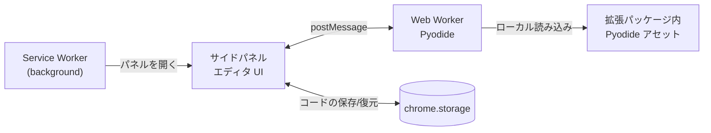

# 基本設計

本ドキュメントは、[ADR](ADR/) で決定した内容をひとつの構成としてまとめたものである。個々の選定理由は各 ADR を参照すること。設計上の新たな決定が生じた場合は、本ドキュメントを直接書き換えるのではなく ADR を起こし、その結果を本ドキュメントに反映する。

## 1. 目的とスコープ

参考となる Web ページを開いたまま、タブ構成を変えずに Python コードを書いて実行できる Chrome 拡張機能。ブラウザだけで完結し、ローカルの Python 環境を必要としない。

**対象** — Python 標準ライブラリの範囲でのコード編集と実行
**対象外** — サードパーティパッケージの利用、複数ファイルからなるプロジェクトの開発、既存 IDE の置き換え

## 2. 全体構成



構成要素は 3 つで、それぞれ独立した実行コンテキストに置かれる。

| コンポーネント | 実行コンテキスト | 責務 |
| --- | --- | --- |
| Service Worker | 拡張のバックグラウンド | ツールバーアイコンでサイドパネルを開く設定のみ |
| サイドパネル UI | サイドパネルの文書 | エディタの表示、実行/停止操作、出力表示、コードの永続化 |
| Pyodide Worker | Web Worker | Pyodide の初期化とユーザコードの実行 |

### 2.1 Service Worker

責務は意図的に最小に留める。インストール時に `chrome.sidePanel.setPanelBehavior({ openPanelOnActionClick: true })` を設定するだけで、実行にもエディタ状態にも関与しない。

Service Worker は待機状態が続くと停止されるため、状態を持たせない（[ADR 0004](ADR/0004-use-pyodide-as-python-runtime.md)）。

### 2.2 サイドパネル UI

エディタ本体。CodeMirror 6 でコードを編集し、Worker へ実行を依頼して結果を表示する。**Python コードをこのスレッドで実行することはない。**

### 2.3 Pyodide Worker

Pyodide の初期化とユーザコードの実行のみを行う。DOM には触れず、出力はすべて `postMessage` で UI へ送る（[ADR 0005](ADR/0005-run-pyodide-in-web-worker.md)）。

Pyodide の実体（`pyodide.asm.wasm`、`python_stdlib.zip` 等）は拡張パッケージ内に同梱されたものをローカルパスから読み込む。CDN からの取得および `micropip` による PyPI からの取得は Manifest V3 が禁止するため行わない（[ADR 0004](ADR/0004-use-pyodide-as-python-runtime.md)）。

## 3. 実行フロー

### 3.1 起動と初期化

1. ユーザがツールバーアイコンをクリックし、サイドパネルが開く
2. UI が Worker を生成する
3. Worker が Pyodide の初期化を開始する
4. **初期化の完了を待たずに、エディタは編集可能な状態で表示する。** 実行ボタンのみ無効にしておく
5. 初期化完了時、Worker が `ready` を送り、UI が実行ボタンを有効化する

Pyodide の初期化は数秒単位のコストがかかるため、エディタ表示と初期化を分離する（[ADR 0004](ADR/0004-use-pyodide-as-python-runtime.md)）。

### 3.2 実行

1. UI が実行ボタンを無効化し、停止ボタンを有効化する
2. UI が `run` メッセージでコードを Worker へ送る
3. Worker が実行し、標準出力・標準エラーを**逐次** `stdout` / `stderr` で UI へ送る
4. UI は受信するたびに出力領域へ追記する
5. 実行終了時、Worker が `done`（正常終了）または `error`（例外）を送る
6. UI がボタンの状態を戻す

出力をまとめて送らないのは、長時間実行中に画面が無反応に見える状態を避けるためである（[ADR 0005](ADR/0005-run-pyodide-in-web-worker.md)）。

### 3.3 停止

Pyodide はシングルスレッドで動作するため、実行中のユーザコードへ「中断」を伝える手段がない。停止は **Worker の破棄**で実現する。

1. ユーザが停止ボタンを押す
2. UI が `worker.terminate()` を呼ぶ
3. **Worker と共に Pyodide の状態がすべて失われる**
4. UI は直ちに新しい Worker を生成し、初期化を先行させておく
5. 初期化完了後、実行ボタンを再び有効化する

停止直後に次の実行を待たせないよう、Worker の作り直しは停止処理の一部として行う。

## 4. UI ↔ Worker メッセージ仕様

停止は `terminate()` で行うため、停止要求のメッセージは存在しない。

### UI → Worker

| type | ペイロード | 意味 |
| --- | --- | --- |
| `run` | `{ runId, code }` | コードの実行要求 |

### Worker → UI

| type | ペイロード | 意味 |
| --- | --- | --- |
| `ready` | なし | Pyodide の初期化完了 |
| `stdout` | `{ runId, text }` | 標準出力（逐次） |
| `stderr` | `{ runId, text }` | 標準エラー（逐次） |
| `done` | `{ runId }` | 正常終了 |
| `error` | `{ runId, message, traceback }` | 実行時例外 |
| `initError` | `{ message }` | Pyodide の初期化失敗 |

`runId` は実行ごとの識別子。Worker を破棄せず連続実行した場合に、遅れて届いた出力を破棄済みの実行のものと判別するために用いる。

## 5. 画面レイアウト

サイドパネルは表示幅が狭いため、**要素は縦に積む**（[ADR 0006](ADR/0006-use-side-panel-as-editor-surface.md)）。

```
┌─────────────────────────┐
│ ツールバー  [実行] [停止] │
├─────────────────────────┤
│                         │
│   エディタ               │
│   (CodeMirror 6)        │
│                         │
├─────────────────────────┤
│   出力領域               │
│   stdout / stderr       │
└─────────────────────────┘
```

VS Code のようなサイドバーとエディタの横並び構成は幅の制約から成立しない。ファイルツリーのような常時表示の横並び UI は設計に含めない。

## 6. ディレクトリ構成

```
web-python-editor/
├── manifest.json
├── package.json
├── build.js                    esbuild のビルド定義
├── src/
│   ├── background/
│   │   └── service-worker.js
│   ├── sidepanel/
│   │   ├── sidepanel.html
│   │   ├── main.js             UI 制御、Worker とのやり取り
│   │   ├── editor.js           CodeMirror 6 の構成
│   │   └── style.css
│   ├── worker/
│   │   └── pyodide-worker.js
│   └── shared/
│       └── protocol.js         メッセージ種別の定義（UI / Worker 共用）
├── vendor/
│   └── pyodide/                同梱する Pyodide 一式（コピー元）
├── docs/
│   ├── design.md
│   └── ADR/
└── dist/                       ビルド成果物。拡張の読み込み対象
```

## 7. ビルド

esbuild で依存を結合し、静的アセットを `dist/` へコピーする。トランスパイルは行わない（[ADR 0007](ADR/0007-use-esbuild-as-bundler.md)）。

**バンドル対象（3 エントリポイント、出力は ESM）**

- `src/background/service-worker.js`
- `src/sidepanel/main.js` — CodeMirror 6 の依存がここで結合される
- `src/worker/pyodide-worker.js`

**コピー対象**

- `manifest.json`
- `src/sidepanel/sidepanel.html`、`style.css`
- `vendor/pyodide/` 一式

Pyodide の wasm / zip は**バンドル対象から除外**し、コピー先のパスを Worker の読み込みパスと一致させる。

`dist/` が拡張の読み込み対象となるため、開発時もソースツリーを直接読み込むことはできず、ビルドを挟む。HMR は使わず、確認はビルド + 拡張のリロードで行う（watch モードでビルドは自動化できる）。

## 8. manifest.json の要点

```json
{
  "manifest_version": 3,
  "minimum_chrome_version": "114",
  "permissions": ["sidePanel", "storage"],
  "side_panel": { "default_path": "sidepanel/sidepanel.html" },
  "background": {
    "service_worker": "background/service-worker.js",
    "type": "module"
  },
  "content_security_policy": {
    "extension_pages": "script-src 'self' 'wasm-unsafe-eval'; object-src 'self'"
  }
}
```

- `'wasm-unsafe-eval'` は Pyodide の WebAssembly 実行に必須（[ADR 0004](ADR/0004-use-pyodide-as-python-runtime.md)）
- `minimum_chrome_version: 114` は `chrome.sidePanel` API の要件（[ADR 0006](ADR/0006-use-side-panel-as-editor-surface.md)）
- `storage` 権限は編集中コードの永続化に用いる（§9 の未決定事項）

## 9. 未決定事項

以下は本設計では確定させない。決定した時点で ADR を起こし、本ドキュメントへ反映する。

| 項目 | 論点 | 由来 |
| --- | --- | --- |
| コードの永続化方式 | `chrome.storage` への保存粒度とタイミング。パネルを閉じると編集中コードが失われるため対応が必要 | [ADR 0006](ADR/0006-use-side-panel-as-editor-surface.md) |
| `input()` の扱い | Python 側は同期的に待つが Worker → UI の問い合わせは非同期。`SharedArrayBuffer` + `Atomics.wait` と cross-origin isolation が必要。非対応とする選択肢もある | [ADR 0005](ADR/0005-run-pyodide-in-web-worker.md) |
| CodeMirror 6 の構成範囲 | 補完・検索・折りたたみ・キーバインドのどこまでを組み込むか。サイドパネルの幅の制約も判断材料になる | [ADR 0003](ADR/0003-use-codemirror6-as-editor.md) |

### 実装時に検証が必要な点

決定ではなく、前提の確認として実装時に確かめる。

- タブ切り替え時にサイドパネルの文書が保持されるか（保持されない場合、Pyodide の初期化コストを繰り返し支払うことになる）
- 拡張の manifest で `cross_origin_embedder_policy` / `cross_origin_opener_policy` を指定して cross-origin isolation を有効化できるか（`input()` 対応の前提）
